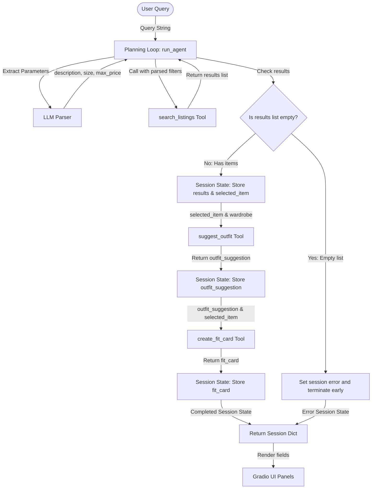

# FitFindr — planning.md

> Complete this document before writing any implementation code.
> Your spec and agent diagram are what you'll use to direct AI tools (Claude, Copilot, etc.) to generate your implementation — the more specific they are, the more useful the generated code will be.
> Your planning.md will be reviewed as part of your submission.
> Update it before starting any stretch features.

---

## Tools

List every tool your agent will use. For each tool, fill in all four fields.
You must have at least 3 tools. The three required tools are listed — add any additional tools below them.

### Tool 1: search_listings

**What it does:**
<!-- Describe what this tool does in 1–2 sentences -->
Searches the mock listings dataset loaded from JSON for clothing items that match the user's description, size, and price limits. It scores listings based on keyword match density and returns sorted results.

**Input parameters:**
<!-- List each parameter, its type, and what it represents -->
- `description` (str): Search terms describing the item (e.g. "vintage graphic tee", "track jacket").
- `size` (str | None): Optional size filter (e.g. "M", "L", "W30"). Substring checking is case-insensitive.
- `max_price` (float | None): Optional maximum price ceiling. Only items at or below this price are returned.

**What it returns:**
<!-- Describe the return value — what fields does a result contain? -->
A list of matching listing dictionaries, where each dictionary represents a listing with fields: `id`, `title`, `description`, `category`, `style_tags`, `size`, `condition`, `price`, `colors`, `brand`, and `platform`. The list is sorted in descending order of keyword match score.

**What happens if it fails or returns nothing:**
<!-- What should the agent do if no listings match? -->
Returns an empty list `[]` (no exception raised). The agent halts further tool execution, logs a helpful message in the session state error field, and returns early to prevent downstream failures.

---

### Tool 2: suggest_outfit

**What it does:**
<!-- Describe what this tool does in 1–2 sentences -->
Generates styling suggestions using Groq's `llama-3.3-70b-versatile` model by combining a newly selected listing with items from the user's existing wardrobe. If the wardrobe is empty, it uses the same model to provide general styling suggestions.

**Input parameters:**
<!-- List each parameter, its type, and what it represents -->
- `new_item` (dict): The selected listing dictionary representing the piece the user wants to buy.
- `wardrobe` (dict): The user's wardrobe dictionary, which contains an `"items"` list of closet items (name, category, colors, style tags, notes).

**What it returns:**
<!-- Describe the return value -->
A styled string description recommending 1-2 complete outfit combinations using items from the user's closet (or general styling ideas if the wardrobe is empty).

**What happens if it fails or returns nothing:**
<!-- What should the agent do if the wardrobe is empty or no outfit can be suggested? -->
If the wardrobe is empty, the tool falls back to requesting general styling tips for the item from the LLM instead of crashing or returning an empty string. If an API error occurs, returns a fallback styling advisory.

---

### Tool 3: create_fit_card

**What it does:**
<!-- Describe what this tool does in 1–2 sentences -->
Generates a short, engaging, and authentic social media caption (e.g. for Instagram or TikTok) using Groq's `llama-3.3-70b-versatile` model (configured with `temperature=0.85`), highlighting details like name, price, and platform.

**Input parameters:**
<!-- List each parameter, its type, and what it represents -->
- `outfit` (str): The outfit recommendation string produced by `suggest_outfit`.
- `new_item` (dict): The listing dictionary representing the thrifted item.

**What it returns:**
<!-- Describe the return value -->
A string containing a complete, shareable social media caption (1-3 sentences) formatted with optional hashtags, embedding the new item and styling advice in a fun, conversational tone.

**What happens if it fails or returns nothing:**
<!-- What should the agent do if the outfit data is incomplete? -->
If the outfit string is missing or unusable, the tool falls back to generating a standalone caption for the `new_item` using general styling advice, rather than crashing or returning an empty string.

---

### Additional Tools (if any)

<!-- Copy the block above for any tools beyond the required three -->

---

## Planning Loop

**How does your agent decide which tool to call next?**
The agent uses a conditional planning loop implemented in `run_agent(query, wardrobe)`:
1. **Initialize Session State**: Creates a clean session object tracking inputs, intermediate results, and errors.
2. **Query Parsing**: Calls Groq's `llama-3.3-70b-versatile` (configured with `temperature=0.0` for deterministic parsing) to parse the natural language query into specific filters: `description` (str), `size` (str or null), and `max_price` (float or null).
3. **Execution Branching**:
   - Call `search_listings(description, size, max_price)`.
   - If results list is empty: Stop execution immediately. Set `session["error"]` to an informative message suggesting search parameters to loosen, and return the session.
   - If results exist: Select the top matching item (`session["selected_item"]`) and proceed to styling.
4. **Outfit Generation**: Call `suggest_outfit(selected_item, wardrobe)` and store in `session["outfit_suggestion"]`.
5. **Fit Card Generation**: Call `create_fit_card(outfit_suggestion, selected_item)` and store in `session["fit_card"]`.
6. **Return**: Deliver the final session dictionary to the UI.

---

## State Management

**How does information from one tool get passed to the next?**
<!-- Describe how your agent stores and accesses state within a session. What data is tracked? How is it passed between tool calls? -->

Information is maintained across tool calls within a single execution session using a central `session` dictionary:
- `query` (str): Raw input from the user.
- `parsed` (dict): Extracted filters (`description`, `size`, `max_price`).
- `search_results` (list[dict]): Full list of matched listings.
- `selected_item` (dict): The chosen listing to style.
- `wardrobe` (dict): The active closet items.
- `outfit_suggestion` (str): Output from `suggest_outfit`.
- `fit_card` (str): Output from `create_fit_card`.
- `error` (str | None): Set to a descriptive string if any step fails.

Each step reads directly from this dictionary and writes its output back to the dictionary, passing parameters downstream without re-prompting the user.

---

## Error Handling

| Tool | Failure mode | Agent response |
|------|-------------|----------------|
| search_listings | No results match the query | Stop planning loop execution early. Set `session["error"]` to a helpful message suggesting the user try checking spelling, adjusting the price ceiling, or removing the size constraint. Return the session dict. |
| suggest_outfit | Wardrobe is empty | Fallback to requesting the LLM to provide general styling recommendations, color pairings, and aesthetic vibes for the new item, instead of searching the wardrobe or crashing. |
| create_fit_card | Outfit input is missing or incomplete | Generate a standalone OOTD caption focusing solely on the `new_item` details (price, brand, platform) without referencing the custom wardrobe styling, instead of failing or raising an exception. |

---

## Architecture

<!-- Draw a diagram of your agent showing how the components connect:
     User input → Planning Loop → Tools (search_listings, suggest_outfit, create_fit_card)
                                                                          ↕
                                                                   State / Session
     Show what triggers each tool, how state flows between them, and where error paths branch off.
     ASCII art, a Mermaid diagram (https://mermaid.js.org/syntax/flowchart.html), or an embedded
     sketch are all fine. You'll share this diagram with an AI tool when asking it to implement
     the planning loop and each individual tool. -->

---

## AI Tool Plan

<!-- For each part of the implementation below, describe:
     - Which AI tool you plan to use (Claude, Copilot, ChatGPT, etc.)
     - What you'll give it as input (which sections of this planning.md, your agent diagram)
     - What you expect it to produce
     - How you'll verify the output matches your spec before moving on

     "I'll use AI to help me code" is not a plan.
     "I'll give Claude my Tool 1 spec (inputs, return value, failure mode) and ask it to implement
     search_listings() using load_listings() from the data loader — then test it against 3 queries
     before trusting it" is a plan. -->

**Milestone 3 — Individual tool implementations:**
- **AI Tool**: Groq console's `llama-3.3-70b-versatile` API.
- **Input**: The Tool 1, Tool 2, and Tool 3 specifications under the `## Tools` section of `planning.md` (which describe parameters, types, returns, and specific fallbacks).
- **Expected Output**: Three complete Python functions (`search_listings`, `suggest_outfit`, `create_fit_card`) implemented in `tools.py` that match the specs and docstrings.
- **Verification**: Create a `tests/test_tools.py` file and run `pytest tests/` to assert:
  1. `search_listings` filters by price and size, scores keyword overlap, and returns `[]` without error on empty results.
  2. `suggest_outfit` handles empty closets by outputting generic styling advice and suggests clothes-specific combinations when the wardrobe has items.
  3. `create_fit_card` falls back to a standalone item description if the outfit suggestion is empty.

**Milestone 4 — Planning loop and state management:**
- **AI Tool**: Groq console's `llama-3.3-70b-versatile` API.
- **Input**: The `## Planning Loop`, `## State Management`, and `## Architecture` sections from `planning.md` detailing the session dict schema and flowchart.
- **Expected Output**: The implementation of `run_agent(query, wardrobe)` in `agent.py` and the `handle_query(user_query, wardrobe_choice)` function in `app.py`.
- **Verification**:
  1. Execute CLI tests inside `agent.py` to print and verify the session dict contents at each step (ensuring state matches and flows).
  2. Test the early-return error branch with a zero-results query and confirm no downstream LLM tools are called.
  3. Start the Gradio app (`python app.py`) and test the end-to-end flow visually in a web browser.

---

## A Complete Interaction (Step by Step)

FitFindr is an AI fashion agent that orchestrates three sequential tools: it first searches a mock listings dataset matching user queries (`search_listings`), passes the top result to suggest styling combinations with the user's wardrobe (`suggest_outfit`), and finally generates a shareable social media caption (`create_fit_card`). If the search tool returns no listings, the agent handles the failure gracefully by reporting it to the user and halting early; if the wardrobe is empty, `suggest_outfit` falls back to general styling advice.

**Example user query:** "I'm looking for a vintage graphic tee under $30. I mostly wear baggy jeans and chunky sneakers. What's out there and how would I style it?"

**Step 1:**
<!-- What does the agent do first? Which tool is called? With what input? -->
The agent parses the query to extract parameters: description = "vintage graphic tee", size = None, max_price = 30.0.
It calls `search_listings(description="vintage graphic tee", size=None, max_price=30.0)`.
This returns a list of matching listings (e.g., `lst_006`: "Graphic Tee — 2003 Tour Bootleg Style", $24.00, platform "depop").
The agent stores the listings and selects the top item: `lst_006`.

**Step 2:**
<!-- What happens next? What was returned from step 1? What tool is called now? -->
The agent calls `suggest_outfit(new_item=<lst_006>, wardrobe=get_example_wardrobe())`.
Using the example wardrobe, it identifies items like "Baggy straight-leg jeans, dark wash" and "Chunky white sneakers".
The LLM returns an outfit suggestion string: "Pair this bootleg style graphic tee with your dark wash baggy jeans and chunky white sneakers. Throw on the black crossbody bag to finish the look."
This is saved to the session.

**Step 3:**
<!-- Continue until the full interaction is complete -->
The agent calls `create_fit_card(outfit=<outfit suggestion>, new_item=<lst_006>)`.
The LLM generates a casual social media caption (e.g., "just scored this vintage 2003 tour bootleg style tee from depop for $24. paired it with my straight-leg baggy jeans and chunky whites. dynamic fits only 🖤🛹").
This is saved to the session.

**Final output to user:**
<!-- What does the user actually see at the end? -->
The user sees the three results displayed in the UI:
1. **Top listing found:** "Graphic Tee — 2003 Tour Bootleg Style ($24.00, depop, good condition) - Vintage-style bootleg tee with faded graphic..."
2. **Outfit idea:** "Pair this bootleg style graphic tee with your dark wash baggy jeans..."
3. **Your fit card:** "just scored this vintage 2003 tour bootleg style tee..."
